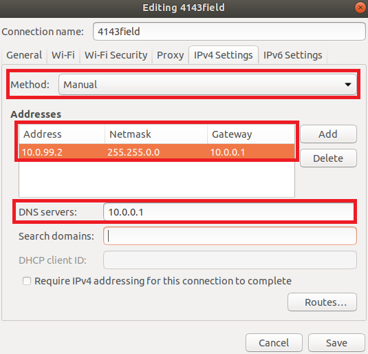

# Setup and Installation Instructions

## RPi Development Enviroment

#### Raspberry Pi OS Install Config
- [ ] Install Raspberry Pi Os on and microSD with a size **greater than 8 GB**
    Raspberry Pi Imager - https://www.raspberrypi.com/software/

#### Network Configuration
- [ ] Connect Raspberry Pi to the Field Network
    - SSID: 4143field
    - Password: Test.123
- [ ] Set Static IP on Raspberry Pi to match robot team number.
- The notation TE.AM is used as part of IPs. This notation refers to splitting your four digit team number into two digit pairs for the IP address octets.

    | Example:  | 10.TE.AM.2 |
    | --------- | ---------- |
    | Team 12   | 10.0.12.2  |
    | Team 4143 | 10.41.43.2 |

    The RoboRio is always given the 10.TE.AM.2 address and the same will be true for the Raspberry Pis.
    More of the network configuration for the official robot can be found here - https://docs.wpilib.org/en/stable/docs/networking/networking-introduction/ip-configurations.html

- Below is an image of a static IP setup for a robot with the Team number 99. Due to the setup of our field network we follow the 10.0.TEAM.2 convention. We are capped to a max team number of 254 due to limitation in IP address bit formatting.

    

#### Development Tools
Raspberry Pi OS comes with a lot of preinstalled packages, but the distro is still missing some needed in order to build our project. The rest of the setup and development will use the terminal (Please see [Terminal Cheat Sheet](#terminal-cheat-sheet) if new to terminal usage).

- [ ] Install *cmake*
    - APT Package Name: cmake

- [ ] Install *Java Development Kit*
    - APT Package Name: openjdk-17-jre

## WPILib Development Environment
These instructions will guide you through setting up the WPILib development environment and cover the basic robot code development work flow. All further instructions require the working directory to be *jetsonNative* project.

#### Gradlew Setup
Gradlew is the compiler used by FRC Teams to compile the program binaries and send them over to the RoboRio. We will use it for our robots as well since the configuration is setup to interface with our vendor libraries.
- [ ] Navigate to the `libbuild` directory
- [ ] Run `cmake ..` to generate updated build targets
- [ ] Run `make` to compile

Navigate back to the project top directory and now you must determine what language you want to program your robot in. This example project is using Java. The `<LANG>` parameter is either `c++` for C++ or `java` for Java.
- [ ] Copy `build.gradle.<LANG>` to `build.gradle`

#### Building Robot Code
Now that Gradlew is configured for our environment we can build the robot code.

TODO

## Terminal Cheat Sheet
The Terminal can be difficult to navigate the file system and preform actions in for beginners, but it will become easier with repeated use. Below is a compiled list of common commands that are used in the terminal.

In some cases these commands will need to be run as super user in order to make changes to the file system. This can be done by prefixing the commands with `sudo`. Be careful when using sudo as the system will not stop you from preforming harmful actions.

### Navigation and File Interaction
These commands are use to navigate out the file system and  preform base interaction with the files

#### Change Directory - `cd`
This command changes the working directory of the terminal.
The working directory can be seen on each input line of the terminal or you can run the command `pwd`.
- `cd <DIR>` - Changes the working directory to `<DIR>`
    ```
    ~> cd test
    ~/test>
    ```
- `cd ..` - Changes the working directory to the parent directory
    ```
    ~/test/info> cd ..
    ~/test>
    ```
- `cd -` - Changes the working directory to the previous directory
    ```
    ~> cd test/info
    ~/test/info> cd -
    ~>
    ```
#### List Files - `ls`
This command lists all files within a directory.
- `ls` - Lists all the files in the working directory of the terminal
    ```
    ~> ls
    test    hello.txt    game.c
    ```
- `ls <DIR>` - Lists all the files in the `<DIR>` directory
    ```
    ~> ls test
    test1.c    test2.c    test3.c
    ```
#### Display File - `cat`
This command displays the contents of a specified file in the terminal
- `cat <FILE>`
    ```
    ~> cat hello.txt
    Hello World!
    ```

#### Copy File - `cp`
This command copies a specified file
- `cp <ORIGINAL> <COPY>` - Copies the `<ORIGINAL>` file and creates a new file with the same contents name `<COPY>`
    ```
    ~> cat hello.txt
    Hello World!
    ~> cp hello.txt helloWorld.txt
    ls
    test    hello.txt    helloWorld.txt    game.c
    ~> cat helloWorld.txt
    Hello World!
    ```

### Git Version Control

TODO

### Package Management
These commands are used to install, update, and uninstall packages using APT.

#### Install Package - `apt install <PACKAGE>`
This command installs the `<PACKAGE>` package

#### Update Packages - `apt update`
This command updates all packages managed by APT

#### Remove Package - `apt remove <PACKAGE`
This command removes the `<PACKAGE>` package